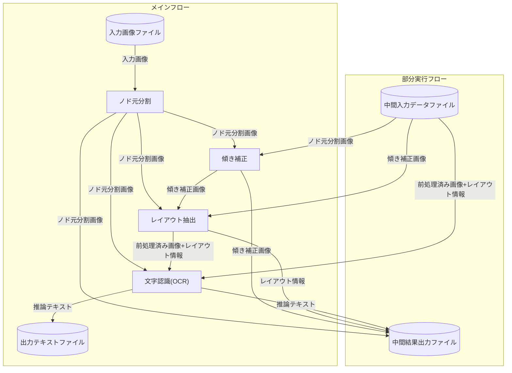

# NDLOCRプログラム用CLI
## 概要
NDLOCRを利用して推論を実行するためのCLIです。  
基本的には`docker`ディレクトリ配下のスクリプトでDocker環境の構築を行い、
その中で`cli`ディレクトリ配下のスクリプトで実行します。  
本プログラムは、国立国会図書館が株式会社モルフォAIソリューションズに委託 
して作成したものです。


## ディレクトリ構成
```
ndlocr_cli
├── main.py : メインとなるPythonスクリプト
├── cli : CLIコマンド的に利用するPythonスクリプト
├── src : 各推論処理のソースコード用ディレクトリ
│   ├── separate_pages_ssd : ノド元分割のソースコード
│   ├── deskew_HT : 傾き補正のソースコード
│   ├── ndl_layout : レイアウト抽出処理のソースコード
│   └── text_recognition : 文字認識処理のソースコード
├── config.yml : サンプルの推論設定ファイル
├── docker : Dockerによる環境作成のスクリプト類
├── README.md : このファイル
└── requirements.txt : Python の必要パッケージリスト
```

## チュートリアル
### Dockerの生成と実行
Dockerをビルドする前に、`src`ディレクトリ内に各推論処理のリポジトリを格納しておく必要があります。  
その後、本リポジトリのトップで`./docker/dockerbuild.sh`を実行すると、
`python:3.7.9-buster` イメージをベースとして、必要なパッケージをインストールした`ocr-cli-py37` というイメージをビルドします。  
`docker images`コマンドでイメージが生成されたか確認できます。  
イメージ生成後、`run_docker.sh`を実行することでDockerコンテナを起動できます。  
起動後は以下のような`docker exec`コマンドを利用してコンテナにログインできます。

```
docker exec -i -t --user root ocr_cli_runner bash
```

### 推論処理の実行
Workstation形式(後述)のinputディレクトリ構成であれば、以下のコマンドで実行することができます。
```
python main.py infer sample_data output_dir
```

single形式(inputディレクトリ直下にimgディレクトリが存在する)のinputディレクトリ構成であれば、以下のコマンドで実行することができます。
```
python main.py infer sample_data output_dir -s s
```

各部分の推論結果による中間出力を全てdumpする場合は`-d`オプションを追加してください。
中間出力結果のファイルは出力ディレクトリ配下の`dump`ディレクトリに保存されます。
(行認識のdumpでは認識された文字列の重畳は行われず、レイアウト認識と同じものが出力されます)
- `-d`オプション実行後の出力例
```
output_dir/
├── PID
│   ├── dump
│   │   ├── 0_page_sep
│   │   │   └── pred_img
│   │   ├── 1_page_deskew
│   │   │   ├── pred_img
│   │   │   └── xml
│   │   ├── 2_layer_ext
│   │   │   ├── pred_img
│   │   │   └── xml
│   │   └── 3_line_ocr
│   │       ├── pred_img
│   │       ├── txt
│   │       └── xml
│   ├── pred_img
│   ├── txt
│   └── xml
└── opt.json
```

入力形式によらず、推論処理の部分実行を行うときは`-p`オプションを利用します。
例えば[ノド元分割]から[レイアウト抽出]までを実行する場合は次のコマンドとなります。
```
python main.py infer sample_data output_dir -p 0..2 -s s
```

**既にページ単位の画像になっている等、ノド元分割が不要の場合は[傾き補正]から[文字認識(OCR)]までを実行すればよく、次のコマンドとなります。**
```
python main.py infer sample_data output_dir -p 1..3 -s s
```

`-p`の番号と処理の内容の対応関係は次の通りです。
* '-p 0': ノド元分割
* '-p 1': 傾き補正
* '-p 2': レイアウト抽出
* '-p 3': 文字認識(OCR)


重みファイルのパス等、各モジュールで利用する設定値は`config.yml`の内容を修正することで変更することができます。

## 入出力仕様
### 入力ディレクトリについて
入力ディレクトリの形式は以下の4パターンを想定しており、
それぞれ`-s`オプションで指定することができます。
(デフォルトはWorkstation modeです)

- Sigle input dir mode
```
input_root
 ├── xml
 │   └── R[7桁連番].xml※XMLデータ
 └── img
     └── R[7桁連番]_pp.jp2※画像データ
```

- Partial inference mode
(過去に実行した部分実行の結果を入力とする場合はこちら)
```
input_root
 └── PID
     ├── xml
     │   └── R[7桁連番].xml※XMLデータ
     └── img
         └── R[7桁連番]_pp.jp2※画像データ   
```

- ToshoData mode
```
input_root
 └── tosho_19XX_bunkei
     └── R[7桁連番]_pp.jp2※画像データ   
```

- Workstation mode
```
input_root
 └── workstation
     └── [collect(3桁数字)、またはdigital(3桁数字)]フォルダ
          └── [15桁連番]フォルダ※PID上1桁目
               └── [3桁連番]フォルダ※PID上2～4桁目
                    └── [3桁連番]フォルダ※PID上5～7桁目
                         └── R[7桁連番]_contents.jp2※画像データ
```

- Image file mode
(単体の画像ファイルを入力として与える場合はこちら)
```
input_root(※画像データファイル)
```

### 出力ディレクトリについて
```
output_dir/
├── PID
│   ├── dump
│   │   ├── 0_page_sep
│   │   ├── 1_page_deskew
│   │   ├── 2_layer_ext
│   │   └── 3_line_ocr
│   ├── img
│   ├── pred_img
│   ├── txt
│   └── xml
└── opt.json
```

#### オプション情報の保存
出力ディレクトリでは、実行時に指定したオプション情報が`opt.json`に保存されています。

#### 推論結果(画像、XML)の保存
前処理後の画像を保存するには、`-i`オプションを指定します。この場合、出力ディレクトリ以下の`pred_img`に画像が出力されます。
認識結果を構造化したXMLファイルを保存するには, `-x`オプションを指定します。この場合、**実行中の全ての処理が完了した後に**　`xml`ディレクトリに結果が保存されます。

#### 部分実行時の仕様
`-p`オプションを指定していた場合、`-i`, `-x`オプションの有無と関係なく`pred_img`, `xml`ディレクトリのデータは保存され、
更に最後の推論プロセスで入力として使用した画像が`img`ディレクトリに保存されます。
つまり、推論結果を重畳した画像が`pred_img`, 前処理のみ行われた画像が`img`ディレクトリに保存されます。
前処理のみ行われた画像を保存するのは、この出力ディレクトリを別の部分実行の入力ディレクトリとして利用できるようにするためです。

### 推論処理のデータフロー

